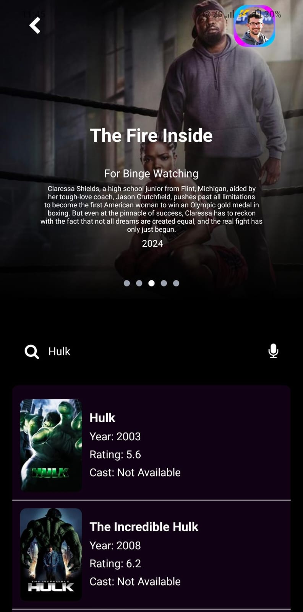
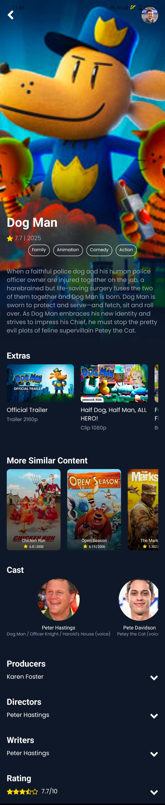
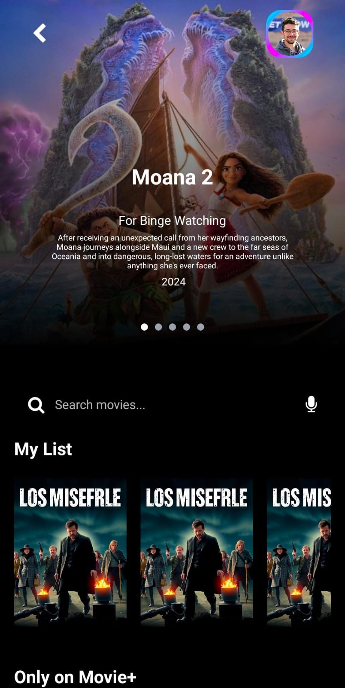
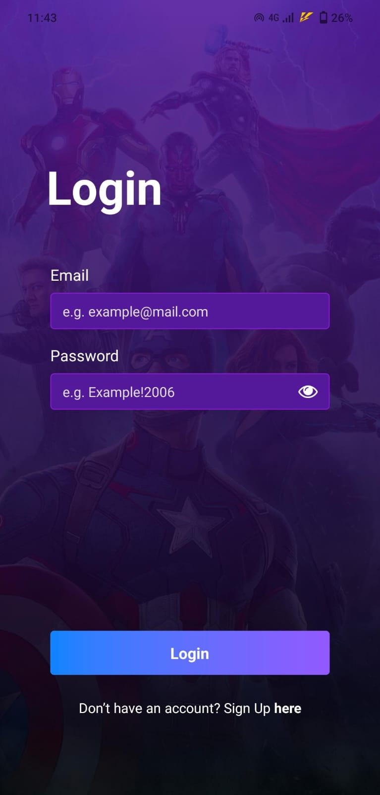

# 🎬 Movie App

Welcome to the **Movie App**, a React Native application that provides an immersive movie browsing experience. Users can explore trending movies, view details, and manage their accounts with an intuitive and visually appealing interface.

## 🚀 Features

- 🔍 **Browse Movies**: Discover trending and new releases.
- 🎭 **Movie Details**: View full details, trailers, and similar movies.
- 🔥 **Popular Actors**: Explore popular movie stars.
- 📝 **User Authentication**: Sign up and log in securely.
- 🌙 **Dark Mode Support**: Automatically adapts to system theme settings.

## 🛠️ Tech Stack

- **Frontend**: React Native, Expo, TypeScript
- **State Management**: React Hook Form, Zustand
- **API**: The Movie Database (TMDb)
- **Navigation**: React Navigation
- **UI**: Tailwind CSS, Linear Gradient, FontAwesome

## 📂 Project Structure

```
📦 movie-app
┣ 📂 src
┃ ┣ 📂 components    # Reusable UI components
┃ ┣ 📂 hooks         # Custom hooks for fetching movie data
┃ ┣ 📂 screens       # Main screens (Home, MovieDetails, Login, Signup)
┃ ┣ 📂 api           # API handlers
┃ ┗ 📂 assets        # Images and static files
┣ 📜 App.tsx         # Entry point
┣ 📜 package.json    # Dependencies
┣ 📜 README.md       # Project documentation
┗ 📜 tsconfig.json   # TypeScript configuration
```

## 🏗️ Installation

1. **Clone the repository**:
   ```sh
   git clone https://github.com/violaClara/reactnative_movieapp.git
   cd movie-app
   ```
2. **Install dependencies**:
   ```sh
   npm install
   ```
3. **Start the application**:
   ```sh
   npm start
   ```

## 📸 Screenshots


 


📌 Developed by **Viola Pramesti**

